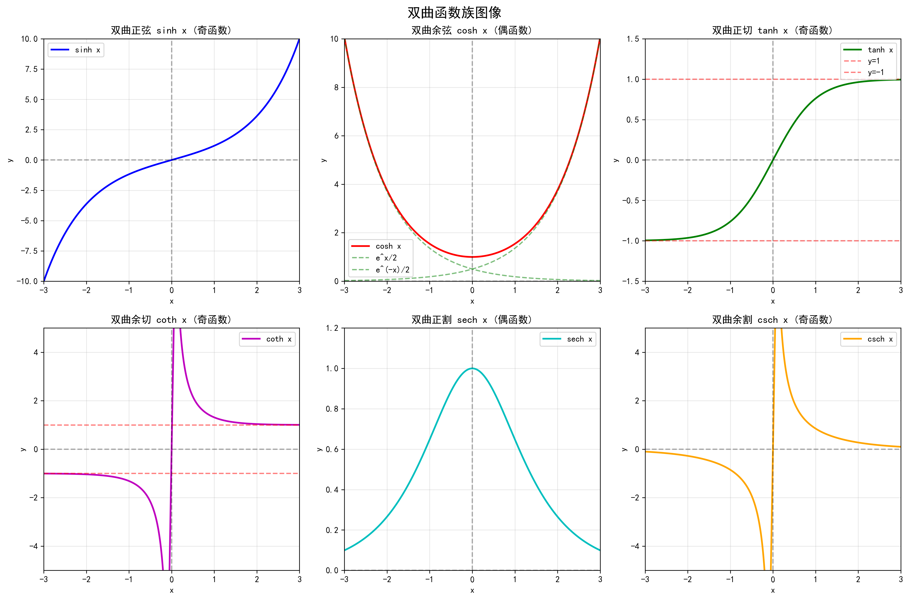

## 奇偶性

### 定义
设函数 $f(x)$ 的定义域关于原点对称：
- **偶函数**：$f(-x) = f(x)$
- **奇函数**：$f(-x) = -f(x)$

### 通俗理解
- **偶函数**：关于 $y$ 轴对称，图像左右对称
- **奇函数**：关于原点对称，图像中心对称

### 几何特征
- 偶函数：$f(x)$ 和 $f(-x)$ 的纵坐标相同
- 奇函数：$f(x)$ 和 $f(-x)$ 的纵坐标相反

### 性质
- 偶函数 × 偶函数 = 偶函数
- 奇函数 × 奇函数 = 偶函数
- 偶函数 × 奇函数 = 奇函数
- 奇函数 + 奇函数 = 奇函数
- 偶函数 + 偶函数 = 偶函数

### 复合函数的奇偶性
**规则**：$f[\varphi(x)]$（内偶则偶，内奇同外）

设复合函数 $f[\varphi(x)]$，其中外层函数为 $f(u)$，内层函数为 $\varphi(x)$：

1. **内层为偶函数**：如果 $\varphi(x)$ 是偶函数，则 $f[\varphi(x)]$ 是**偶函数**
   - 因为 $\varphi(-x) = \varphi(x)$，所以 $f[\varphi(-x)] = f[\varphi(x)]$
   - 例子：$\sin(x^2)$（奇[偶] ⇒ 偶）

2. **内层为奇函数**：如果 $\varphi(x)$ 是奇函数，则 $f[\varphi(x)]$ 的奇偶性**与外层函数相同**
   - 因为 $\varphi(-x) = -\varphi(x)$，所以 $f[\varphi(-x)] = f[-\varphi(x)]$
   - 如果 $f$ 是偶函数：$f[-\varphi(x)] = f[\varphi(x)]$ → 复合函数为偶函数
   - 如果 $f$ 是奇函数：$f[-\varphi(x)] = -f[\varphi(x)]$ → 复合函数为奇函数

**具体规则**（完整版）：

| 外层函数 | 内层函数 | 复合函数 | 例子 |
|---------|---------|---------|------|
| 奇函数 | 偶函数 | **偶函数** | $\sin(x^2)$ |
| 偶函数 | 奇函数 | **偶函数** | $\cos(\sin x)$，$|\sin x|$ |
| 奇函数 | 奇函数 | **奇函数** | $\sin(1/x)$，$\sqrt{\tan x}$ |
| 偶函数 | 偶函数 | **偶函数** | $\cos|x|$，$|\cos x|$ |
| 非奇非偶 | 偶函数 | **偶函数** | $e^{x^2}$，$\ln|x|$ |

**详细说明**：
- **奇[偶] ⇒ 偶**：例如 $\sin(x^2)$（外层 $\sin$ 是奇函数，内层 $x^2$ 是偶函数）
- **偶[奇] ⇒ 偶**：例如 $\cos(\sin x)$，$|\sin x|$（外层是偶函数，内层 $\sin x$ 是奇函数）
- **奇[奇] ⇒ 奇**：例如 $\sin(1/x)$，$\sqrt{\tan x}$（外层和内层都是奇函数）
- **偶[偶] ⇒ 偶**：例如 $\cos|x|$，$|\cos x|$（外层和内层都是偶函数）
- **非奇非偶[偶] ⇒ 偶**：例如 $e^{x^2}$，$\ln|x|$（外层非奇非偶，内层是偶函数）

**记忆口诀**：内偶则偶，内奇同外

### 函数分解定理
**任何定义域关于原点对称的函数都可以唯一地分解为偶函数和奇函数的和：**

$$f(x) = f_e(x) + f_o(x)$$

其中：
- **偶函数部分**：$f_e(x) = \frac{f(x) + f(-x)}{2}$
- **奇函数部分**：$f_o(x) = \frac{f(x) - f(-x)}{2}$

**理解方法**：
- 把 $f(x)$ 和 $f(-x)$ 相加再除以2，得到偶函数部分（对称的部分）
- 把 $f(x)$ 和 $f(-x)$ 相减再除以2，得到奇函数部分（反对称的部分）
- 就像把一个数分解成"对称"和"反对称"两部分

**直观理解**：
- 想象函数图像，偶函数部分是关于 $y$ 轴对称的
- 奇函数部分是关于原点对称的
- 任何函数都可以看作"对称部分"和"反对称部分"的组合
- 这类似于把任意向量分解成水平和垂直分量

**验证**：
- $f_e(-x) = \frac{f(-x) + f(x)}{2} = f_e(x)$ ✓ 是偶函数
- $f_o(-x) = \frac{f(-x) - f(x)}{2} = -\frac{f(x) - f(-x)}{2} = -f_o(x)$ ✓ 是奇函数

### 例子

**函数分解的例子**：
设 $f(x) = e^x$（非奇非偶函数），将其分解：

- 偶函数部分：$f_e(x) = \frac{e^x + e^{-x}}{2} = \cosh x$（双曲余弦）
- 奇函数部分：$f_o(x) = \frac{e^x - e^{-x}}{2} = \sinh x$（双曲正弦）
- 所以：$e^x = \cosh x + \sinh x$

**双曲函数族**：

| 函数 | 符号 | 定义 | 奇偶性 |
|------|------|------|--------|
| 双曲正弦 | $\sinh x$ | $\sinh x = \frac{e^x - e^{-x}}{2}$ | 奇函数 |
| 双曲余弦 | $\cosh x$ | $\cosh x = \frac{e^x + e^{-x}}{2}$ | 偶函数 |
| 双曲正切 | $\tanh x$ | $\tanh x = \frac{\sinh x}{\cosh x} = \frac{e^x - e^{-x}}{e^x + e^{-x}}$ | 奇函数 |
| 双曲余切 | $\coth x$ | $\coth x = \frac{\cosh x}{\sinh x} = \frac{e^x + e^{-x}}{e^x - e^{-x}}$ | 奇函数 |
| 双曲正割 | $\text{sech } x$ | $\text{sech } x = \frac{1}{\cosh x} = \frac{2}{e^x + e^{-x}}$ | 偶函数 |
| 双曲余割 | $\text{csch } x$ | $\text{csch } x = \frac{1}{\sinh x} = \frac{2}{e^x - e^{-x}}$ | 奇函数 |

**关系式**：
- $\cosh^2 x - \sinh^2 x = 1$（双曲函数的恒等式，类似 $\cos^2 x + \sin^2 x = 1$）
- $\tanh x = \frac{\sinh x}{\cosh x}$
- $\coth x = \frac{1}{\tanh x}$
- $\text{sech } x = \frac{1}{\cosh x}$
- $\text{csch } x = \frac{1}{\sinh x}$

再如 $f(x) = x^3 + x^2$：
- 偶函数部分：$f_e(x) = \frac{(x^3 + x^2) + ((-x)^3 + (-x)^2)}{2} = \frac{x^3 + x^2 - x^3 + x^2}{2} = x^2$
- 奇函数部分：$f_o(x) = \frac{(x^3 + x^2) - ((-x)^3 + (-x)^2)}{2} = \frac{x^3 + x^2 + x^3 - x^2}{2} = x^3$
- 所以：$x^3 + x^2 = x^2 + x^3$（正好是偶函数部分 + 奇函数部分）

**其他例子**：
- **偶函数**：$f(x) = x^2$，$f(x) = \cos x$，$f(x) = |x|$
- **奇函数**：$f(x) = x$，$f(x) = \sin x$，$f(x) = x^3$
- **非奇非偶**：$f(x) = x + 1$，$f(x) = e^x$

### 注意
- 判断奇偶性前，先确认定义域是否关于原点对称
- 如果 $f(-x) \neq f(x)$ 且 $f(-x) \neq -f(x)$，则为非奇非偶函数

